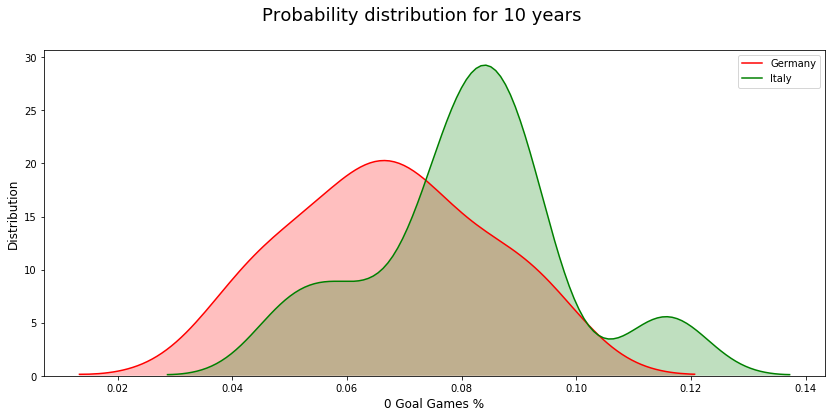

# What metrics matter in Soccer?

## Table of Contents
1. [Introduction](#introduction)
    - [Background](#background)
    - [Data](#data)

2. [Exploratory Data Analysis](#exploratory-data-analysis)
    - [What metrics were available?](#what-metrics-were-available)
    - [What metrics matter?](#what-metrics-matter)

3. [Hypothesis Testing](#Hypothesis-testing)
    1. [Is the average number of games with 0-0 score lower than 8%?](#hypothesis-test-1)
        - [Model Choice](#model-choice-1)
        - [Results](#results-1)
    2. [Does the German league, on average have a lower 0-0 resulting games compared to the Italian league?](#hypothesis-test-2)
        - [Model Choice](#model-choice-1)
        - [Results](#results-2)
4. [Conclusion](#conclusion)
    * [Take Away & Final Thoughts](#take-away-&-final-thoughts)
    * [Future works](#future-works)
- [Built with](#built-with)
- [Author](#author)

---

## Introduction

### Background
Soccer is the most popular sport in the world with about [3.5 billion fans](https://sportsshow.net/top-10-most-popular-sports-in-the-world/) worldwide— more than basketball, baseball, and american football fans combined. 

I’ve been a fan of soccer for about 20 years so I was interested in knowing more about the sport. I wanted to analyze which metric mattered to wins. I gathered stats from the last 10 years from soccer leagues in England, Spain, Germany and Italy. I chose these 4 leagues because they were the only countries that had an UEFA Champions League champion in the last 10 years. The UEFA Champions League is considered the most competitive competition in the world so I made sure I was to taking stats from the best leagues. 

### Data
I used datasets that were available from a betting [site](http://www.football-data.co.uk/) in the UK.

It contained a total of 40 CSV files.  There were 14466 Rose and 80 Columns of pre-process data.

I filtered out; 
1) columns that had less than 1% null values, 
2) betting odds, 
3) 3 Italian games that had null values. 

I ended up with 14457 rows and 26 columns after cleaning the data. I mainly worked around averages because the German league had 34 games per season compared to 38 games for all other leagues.

---

## Exploratory Data Analysis

### What metrics were available?
I wanted to find out which metrics contribute to wins. There were 26 different metrics in the dataset, and I chose 9 that seemed relevant after analyzing with a Scatter Matrix. Those 9 stats includes;

- Goals 
- Halftime lead 
- Halftime goals 
- Shots 
- Shots on target 
- Corner kicks 
- Fouls committed by opponent
- Yellow cards committed by opponent
- Red cards committed by opponent

### What metrics matter?
I quantified each metric’s correlations with wins using Pearson’s correlation method. I found there were 6 metrics with positive correlations and 3 metrics with no correlations. 

**Positive correlation with >= 0.5**

| Positive       | Correlation |
| -------------- | ----------- |
| **Goals**      | **0.92**    |
| Half time lead | 0.89        |
| Half time goals| 0.86        |
| Shots          | 0.75        |
| Shots on Target| 0.67        |
| Corner Kicks   | 0.66        |

**No correlation with < 0.5 & > -0.5**

| No correlation  | Correlation |
| -------------- | ------------ |
| Yellow cards   | 0.21         |
| Red cards      | 0.01         |
| Fouls          | -0.16        |

**Goals had the highest correlations to wins with 0.92.** I was surprised that when the opponent committed a red card, it had no correlation to winning even though the opponent was short one person (due to ejection).

So goals matter to winning. As a soccer fan, one of the most upsetting games to watch is a game ending in both teams scoring 0 goals. Even being a fan for 20 years, I consider these games “boring.” 
The average number of games resulting in a “boring” 0-0 score was 7.5% over the last 10 years in 4 different leaves combined. There were 1,090 games that ended with 0-0 score out of 14,456 games in the last 10 years.  The averages among different leagues are shown below:

| Country | 0 Goal Games |
| ------- | ------------ |
| Germany | 6.7%         |
| Spain   | 7.5%         |
| England | 7.6%         |
| Italy   | 8.1%         |

---

## Hypothesis Testing

### Hypothesis Test 1

**Is the average number of games with 0-0 score lower than 8%?**

My first hypothesis test was to see whether the average number of games ending in 0-0 score was lower than 8% (approxi 1/12 odds). I chose this threshold because I wanted to know if I were to watch 1 soccer game a month for a year, how likely is it that I would end up watching a “boring” game. Watching a game with no goals is probably one of the most upsetting parts of being a fan of the game and I want to be confident that the probability would be less than 8%.  

**Null hypothesis:** The average number of games with 0 goal = 8%.
**Alternative hypothesis:** The average number of games with 0 goal < 8%.

**Alpha = 0.05**

#### Model Choice 1

Binomial Distribution

Since I had data that resulted in 0-0 score for the last 10 years I used a binomial distribution to calculate my hypothesis test.

#### Results 1

**P-Value Result: 0.021**

The hypothesis test result shows that the P-value resulted in 0.021 and since this is below the 0.05 threshold I could reject the null hypothesis. Therefore, the average number of games with 0 goals being less than 8% with a threshold of 0.05 holds true.

---

### Hypothesis Test 2

**Does the German league, on average have a lower 0-0 resulting games compared to the Italian league?**

Since Germany’s league had the lowest average number of games with 0 goals and Italy had the highest, I wanted to compare those two leagues if that was statistically significant. If I were to watch a soccer game, should I watch the league in Germany over Italy’s?

**Null hypothesis:** The average number of games with 0 goals in Germany = Italy.

**Alternative hypothesis:** The average number of games with 0 goals in Germany < Italy.

**Alpha = 0.05**

#### Model Choice 2

- Welch’s T-Test
- Mann-Whitney U-Test (Two-Sided)

I divided the average number of games with 0 goals over 10 seasons for both leagues in Germany and Italy so that I could have 2 sample distributions to compare each other.  I applied the Welch’s T-Test and Mann-Whitney U-Test using these 2 sample distributions with both sample size with n=10. 

#### Results 2

The hypothesis test result shows that the P-value for both Welch’s T-Test and Mann-Whitney U-Test resulted in 0.092 and 0.14 respectively. Since both results are above the 0.05 threshold, we cannot reject the null hypothesis that the average number of games with 0 goals in Germany = Italy.

I’ve tried testing Welch's T-Test and Mann-Whitney U-Test to all other leagues against each other with the same method, but they all showed the results above the 0.05 threshold.

---

## Conclusion

### Take Away & Final Thoughts

I thought that there would be a difference in average games with 0 goals scored in Italy compared to other leagues because Italy had historically been known playing a [defensive soccer style](https://en.wikipedia.org/wiki/Catenaccio).

I was surprised that red cards had no correlation of winning even though the opponent is down one person. But at the same time, it does make sense because sometimes a winning team commits a hard foul when the opponent team is about to score. I’ve witnessed this event countless times especially in big games.

### Future works

In the future, I would want to collect more years worth of data since my sample size for average 0 goals for each year was limited. 
I could compare results with more competitive games in the UEFA Champions League and see if there are any statistically significant differences. A lot of times, the good teams will reserve their star players in the league so they can compete in the Champions League games. 
Also, since this data didn't provide statistics of free-kick in near goal areas, it would be interesting to see if there’s a correlation to winning. 

---

## Built With

* **Software Packages:**  [Python](https://www.python.org/),  [Pandas](https://pandas.pydata.org/docs/), [Numpy](https://numpy.org/), [Matplotlib](https://matplotlib.org/), [Scipy](https://docs.scipy.org/doc/), [Seaborn](https://seaborn.pydata.org/)
* **Hypothesis Methods:** [Pearson correlation coefficient](https://en.wikipedia.org/wiki/Pearson_correlation_coefficient), [One-sample t-test](https://en.wikipedia.org/wiki/Student%27s_t-test), [Welch's t-test](https://en.wikipedia.org/wiki/Welch%27s_t-test), [Mann–Whitney U test](https://en.wikipedia.org/wiki/Mann%E2%80%93Whitney_U_test)

## Author

* **Takeshi Sugiyama** - *Data Scientist*
  * [Linkedin](https://www.linkedin.com/in/takeshi-sugiyama/)
  * [Tableau](https://public.tableau.com/profile/takeshi.sugiyama)

